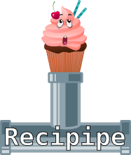
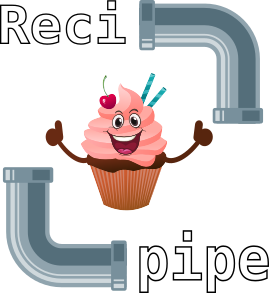
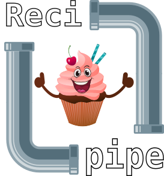

  

# Font

DejaVu Sans Mono, bold, size adjusted manually.

# Resources

* Muffin: [Food vector created by freepik - www.freepik.com][muffin]
* Pipe: [Water vector created by freepik - www.freepik.com][pipe]
* Face: [Face vector created by brgfx - www.freepik.com][face]

# Other proposed designs

&emsp;

&emsp;

[muffin]: https://www.freepik.com/free-photos-vectors/food
[pipe]: https://www.freepik.com/free-photos-vectors/water
[face]: https://www.freepik.com/free-photos-vectors/face

